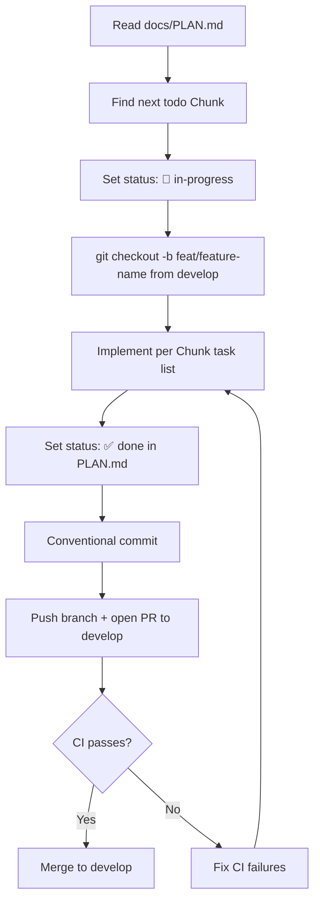
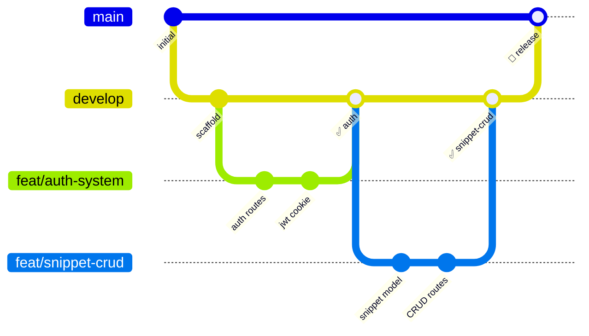
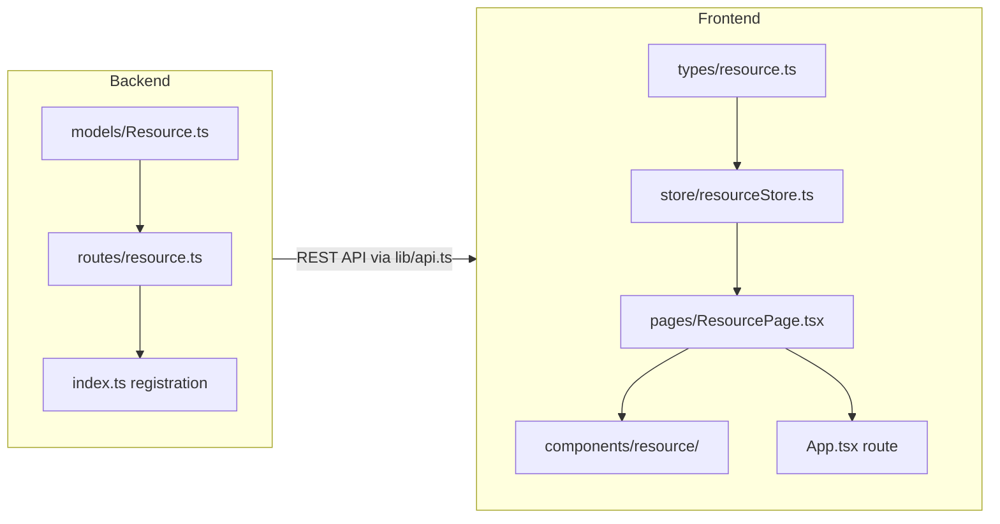
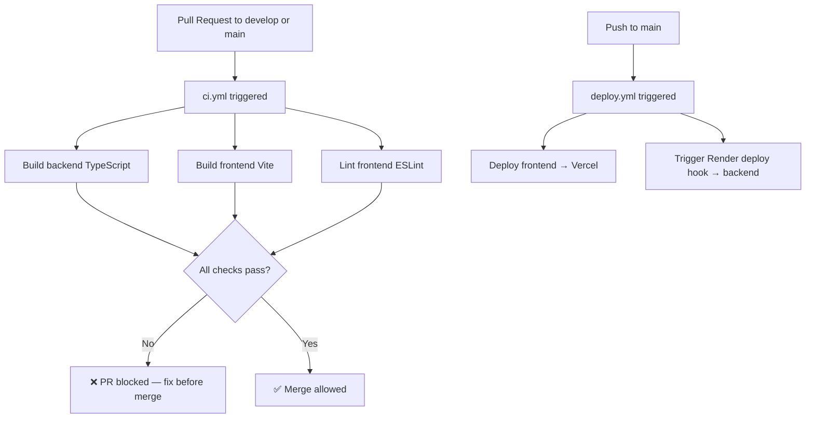

# DevVault — Developer Guidelines

> **This document is the single source of truth for all contributors.**
> Read it fully before touching any code. Every rule here exists for a reason.

## Table of Contents

1. [Project Overview](#1-project-overview)
2. [Agent Workflow Protocol](#2-agent-workflow-protocol)
3. [Git Branch Convention](#3-git-branch-convention)
4. [Backend Clean Code Rules](#4-backend-clean-code-rules)
5. [Frontend Clean Code Rules](#5-frontend-clean-code-rules)
6. [Security Rules](#6-security-rules)
7. [Adding New Features — Checklist](#7-adding-new-features--checklist)
8. [Environment Variables Reference](#8-environment-variables-reference)
9. [CI/CD Pipeline](#9-cicd-pipeline)

---

## 1. Project Overview

**DevVault** is a personal **React Component library vault** — a place where developers save, organise, and rediscover their own reusable React components and code snippets.

The core value proposition is the **Visual Gallery**: the list/dashboard view renders every stored component live inside a sandboxed iframe (powered by Sandpack), so a developer can scroll through their library and immediately see what each component looks like — no need to open files or remember names. When they spot the one they want, they can open it, copy the code, or fork it into a new project.

Secondary features include a split-view editor (code left, live preview right), a recursive folder system for organising by project or category, privacy levels (private / friends-only / public) for optional sharing, and a read-only Flutter mobile companion for browsing the gallery on the go.

### Tech Stack

| Layer | Technology |
|---|---|
| Frontend | Vite + React 19 + TypeScript + Tailwind CSS + HeroUI + React Router v7 + Zustand |
| Backend | Node.js + Express + TypeScript + Mongoose |
| Database | MongoDB Atlas |
| Auth | JWT + HttpOnly Cookie + bcrypt |
| Deploy | Vercel (frontend) + Render (backend) |
| CI/CD | GitHub Actions |

### Repository Structure

```
final2/
├── backend/
│   └── src/
│       ├── config/database.ts       # Mongoose connect — calls process.exit(1) on failure
│       ├── middleware/auth.ts       # verifyToken middleware + AuthRequest interface
│       ├── models/User.ts           # Mongoose User model with comparePassword()
│       ├── routes/auth.ts           # /auth/register, /auth/login, /auth/logout, /auth/me
│       └── index.ts                 # Express app setup: helmet, cors, cookieParser
├── web/
│   └── src/
│       ├── components/
│       │   ├── auth/                # AuthPageBackground, BrandHeader, ErrorAlert, FormInput, SubmitButton
│       │   └── layout/ProtectedRoute.tsx
│       ├── context/AuthContext.tsx  # Legacy — superseded by Zustand store. Do not use.
│       ├── lib/api.ts               # Axios instance: baseURL=VITE_API_URL, withCredentials:true
│       ├── pages/                   # LoginPage, RegisterPage, DashboardPage
│       ├── store/authStore.ts       # Zustand auth store (login, register, logout, fetchMe)
│       ├── types/auth.ts            # User, AuthContextType interfaces
│       └── utils/errorUtils.ts     # Axios error parsing utilities
├── docs/
│   ├── PLAN.md                      # Feature-based implementation tracker
│   ├── PRD.md                       # Product requirements
│   └── GUIDELINES.md                # This file
├── .github/workflows/
│   ├── ci.yml                       # Build + lint on every PR to develop/main
│   └── deploy.yml                   # Auto-deploy on push to main → Vercel + Render
├── render.yaml                      # Render backend service config
└── web/vercel.json                  # Vercel SPA rewrite rules
```

### Core UX Concept — Three Views

> **Every agent must understand all three views and when to use each.**

The app has **three distinct views** for components, each with a different Sandpack usage:

---

#### A. Dashboard Gallery (Chunk 5)

The main dashboard is a scrollable grid of **live-rendered component cards**. Each card uses `<SandpackPreview>` (read-only, no editor) so users see actual running output — buttons, calendars, forms — directly in the grid.

```
┌──────────────────────────────────────────────────────┐
│  Dashboard — My Components                  [+ New]  │
├──────────────┬──────────────┬──────────────┬─────────┤
│ ┌──────────┐ │ ┌──────────┐ │ ┌──────────┐ │   ...   │
│ │ RENDERED │ │ │ RENDERED │ │ │ RENDERED │ │         │
│ │ PREVIEW  │ │ │ PREVIEW  │ │ │ PREVIEW  │ │         │
│ │ (iframe) │ │ │ (iframe) │ │ │ (iframe) │ │         │
│ └──────────┘ │ └──────────┘ │ └──────────┘ │         │
│ GlassButton  │ CalendarPicker│ PricingCard │         │
│ React · 🔒  │ React · 👥   │ React · 🌐  │         │
└──────────────┴──────────────┴──────────────┴─────────┘
```

Rules:
- Use `<SandpackPreview>` per card — no screenshots.
- Lazy-load with Intersection Observer to avoid performance issues.
- Clicking a card navigates to the **Component View page** (`/components/:id`).

---

#### B. Component View Page — `/components/:id` (Chunk 3)

When viewing a single component, the page shows a **tab UI** with two tabs:

```
┌─────────────────────────────────────────────────────┐
│ [Preview]  Code                                     │
├─────────────────────────────────────────────────────┤
│                                                     │
│   ┌─── Live Sandpack iframe ───────────────────┐   │
│   │                                             │   │
│   │   < March 2026  >   < February 2020 >       │   │
│   │   S  M  T  W  T  F  S                       │   │
│   │   1  2  3  4  5  6  7                       │   │
│   │   ...   [3]  ...                            │   │
│   │                                             │   │
│   └─────────────────────────────────────────────┘   │
└─────────────────────────────────────────────────────┘

┌─────────────────────────────────────────────────────┐
│  Preview  [Code]                                    │
├─────────────────────────────────────────────────────┤
│  import {Calendar} from "@heroui/react";            │
│  import {parseDate} from "@internationalized/date"; │
│                                                     │
│  export default function App() {                    │
│    return (                                         │
│      <div className="flex gap-x-4">                 │
│        <Calendar aria-label="Date (No Selection)"/> │
│      </div>                                         │
│    );                                               │
│  }                                                  │
└─────────────────────────────────────────────────────┘
```

Rules:
- **Preview tab**: Full interactive `<SandpackProvider>` + `<SandpackPreview>` — the rendered component is **clickable and fully functional** (not a screenshot, not read-only).
- **Code tab**: Read-only syntax-highlighted view using `<SandpackCodeEditor readOnly />` — beautiful coloured syntax, no editing capability.
- This page also has an **"Edit"** button that navigates to the split-view editor.
- **Do NOT** use `dangerouslySetInnerHTML` for the code tab. Use Sandpack's code editor in read-only mode.

---

#### C. Create / Edit Page — `/components/new` and `/components/:id/edit` (Chunk 3)

Full editing experience with a **side-by-side split view**:

```
┌─────────────────────────────────────────────────────┐
│  /components/:id/edit                               │
├──────────────────────┬──────────────────────────────┤
│  SandpackCodeEditor  │  SandpackPreview             │
│  (editable, full     │  (live update, interactive)  │
│   syntax highlight)  │                              │
│                      │                              │
│  import React...     │  ┌──────────────────────┐    │
│  export default      │  │  rendered output     │    │
│  function App() {    │  │  (clickable)         │    │
│    return <Button /> │  └──────────────────────┘    │
│  }                   │                              │
└──────────────────────┴──────────────────────────────┘
```

Rules:
- Left pane: `<SandpackCodeEditor>` — editable, full syntax highlight.
- Right pane: `<SandpackPreview>` — live interactive preview.
- Template selector (React / Vanilla / HTML+CSS) at the top.
- Save button stores `code` to the backend.

---

**The `code` field is always the single source of truth** — it drives all three views: gallery card, view tab, and editor.

---

## 2. Agent Workflow Protocol

### Which Agent Does What

| Task Type | Agent to Use |
|---|---|
| Feature implementation, bug fixes, code changes | **Dev Agent (Amelia / Winston)** |
| System design, architecture decisions, ADRs | **Architect Agent** |
| Test plans, QA, validation | **QA Agent (Quinn)** |
| Requirements clarification, backlog management | **PM Agent** |
| Documentation, diagrams, standards | **Tech Writer Agent (Paige)** |

> Do not use the wrong agent for a task. Each agent carries context and rules specific to its role.

### Mandatory Steps Before Starting Any Task

Follow these steps **every time**, without exception:

**Step 1 — Read `docs/PLAN.md`**

Open `docs/PLAN.md` and identify the current Chunk with status `🔲 todo`. Understand its tasks and dependencies before writing a single line of code.

**Step 2 — Mark the Chunk as in-progress**

Update the Chunk status in `docs/PLAN.md`:

```
**Status**: 🔄 in-progress
```

**Step 3 — Create a feature branch from `develop`**

```bash
git checkout develop
git pull origin develop
git checkout -b feat/description
```

Use a short kebab-case summary of the feature (e.g., `feat/snippet-crud`, `feat/folder-system`, `feat/privacy-levels`).

**Step 4 — Implement**

Follow the task checklist in `docs/PLAN.md` for the active Chunk. Adhere to the clean code rules in Sections 4 and 5.

**Step 5 — Mark the Chunk as done**

Update the Chunk status in `docs/PLAN.md`:

```
**Status**: ✅ done
```

**Step 6 — Commit with a conventional commit message**

```bash
git add .
git commit -m "feat: snippet CRUD with basic list UI"
```

See [Section 3](#3-git-branch-convention) for commit message rules.

**Step 7 — Open a PR to `develop`**

Push your branch and open a pull request targeting `develop`. Never push directly to `main`.

```bash
git push origin feat/description
```

### Workflow Diagram



---

## 3. Git Branch Convention

### Branch Names

| Branch | Purpose | Rules |
|---|---|---|
| `main` | Production — auto-deploys via CI/CD | **Never commit directly.** Merges from `develop` only. |
| `develop` | Integration branch | Merge feature branches here. Keep it stable. |
| `feat/description` | Feature branches | Branch from `develop`. Example: `feat/snippet-crud`, `feat/folder-system` |
| `fix/description` | Bug fixes | Branch from `develop`. Example: `fix/auth-cookie-expiry` |
| `ci/description` | CI/CD changes only | Example: `ci/add-lint-step` |

### Branch Flow Diagram



### Conventional Commit Messages

Every commit message follows this format:

```
<type>: <short imperative description>
```

| Prefix | Use for |
|---|---|
| `feat:` | New feature or capability |
| `fix:` | Bug fix |
| `refactor:` | Code restructuring without behaviour change |
| `ci:` | GitHub Actions, deployment config changes |
| `docs:` | Documentation changes only |

**Examples:**

```bash
feat: snippet CRUD with basic list UI
fix: auth cookie not cleared on logout
refactor: extract error handler to middleware
ci: add frontend lint step to ci.yml
docs: add snippet API to GUIDELINES
```

> Keep the description short, imperative, and lowercase. Do not end with a period.

---

## 4. Backend Clean Code Rules

### File Organization

Follow strict single-responsibility: one concern per file.

| File type | Location | Rule |
|---|---|---|
| Route handlers | `backend/src/routes/` | One file per resource (`snippets.ts`, `folders.ts`) |
| Mongoose models | `backend/src/models/` | One file per model |
| Middleware | `backend/src/middleware/` | One concern per file (`auth.ts`, `validate.ts`) |
| App bootstrap | `backend/src/index.ts` | Register routes here with `app.use()` |

### Route Files

- Every route file exports a single `Router` — never call `app.use()` inside a route file.
- Register new routes in `src/index.ts`:

```typescript
// src/index.ts
import snippetRoutes from './routes/snippets';
app.use('/snippets', snippetRoutes);
```

### Models

Put business logic on the Mongoose schema, not inside route handlers.

```typescript
// ✅ Correct — logic lives on the model
UserSchema.methods.comparePassword = async function (candidate: string): Promise<boolean> {
  return bcrypt.compare(candidate, this.passwordHash);
};

// ❌ Wrong — logic leaking into a route handler
const match = await bcrypt.compare(req.body.password, user.passwordHash);
```

### Error Responses

Always return a `{ message: string }` JSON object. Never return raw strings or HTML.

```typescript
// ✅ Correct
res.status(400).json({ message: 'Email is required' });

// ❌ Wrong
res.status(400).send('Email is required');
```

### HTTP Status Code Reference

| Code | Meaning | When to use |
|---|---|---|
| `200` | OK | Successful GET, PUT, DELETE |
| `201` | Created | Successful POST that creates a resource |
| `400` | Bad Request | Missing or invalid input |
| `401` | Unauthorized | Not authenticated (no or invalid token) |
| `403` | Forbidden | Authenticated but not authorized (wrong owner) |
| `404` | Not Found | Resource does not exist |
| `409` | Conflict | Duplicate resource (e.g., email already registered) |
| `500` | Server Error | Unhandled server-side failure |

### Async Route Handlers

All route callbacks must be `async` with explicit `Promise<void>` return type. Wrap the body in `try/catch`.

```typescript
// ✅ Correct
router.post('/', verifyToken, async (req: AuthRequest, res: Response): Promise<void> => {
  try {
    // ...
  } catch (err) {
    res.status(500).json({ message: 'Internal server error' });
  }
});

// ❌ Wrong — unhandled rejection possible
router.post('/', async (req, res) => {
  const data = await SomeModel.find(); // no try/catch
  res.json(data);
});
```

### TypeScript Rules

- **No `any` types.** Define an interface for every shape of data.
- Extend `Request` for middleware that adds properties to the request object:

```typescript
// middleware/auth.ts
export interface AuthRequest extends Request {
  userId?: string;
}
```

---

## 5. Frontend Clean Code Rules

### State Management

Use Zustand stores in `web/src/store/` for all global state. Never prop-drill state more than one level.

```typescript
// ✅ Correct — read from Zustand store
const { user, login } = useAuthStore();

// ❌ Wrong — passing auth state as props through multiple components
<ParentComponent user={user} onLogin={login} />
```

> `web/src/context/AuthContext.tsx` is **legacy**. Do not use it in new code.

### API Calls

Always use the pre-configured Axios instance at `lib/api.ts`. Never use raw `fetch` or hardcode any URL.

```typescript
// ✅ Correct
import api from '@/lib/api';
const res = await api.get('/snippets');

// ❌ Wrong
const res = await fetch('https://devvault-backend.onrender.com/snippets');
```

### Types

All TypeScript interfaces live in `web/src/types/`. Import from there — never define inline interfaces inside component files.

```typescript
// ✅ Correct
import type { User } from '@/types/auth';

// ❌ Wrong — interface defined inside a component
interface User { id: string; email: string; }
```

### Component Size and Responsibility

- Keep components focused on a single responsibility.
- If a component exceeds ~100 lines, split it into smaller sub-components.
- Place reusable UI pieces in `components/`, page-level components in `pages/`.

| Belongs in | Examples |
|---|---|
| `pages/` | `DashboardPage.tsx`, `LoginPage.tsx` |
| `components/auth/` | `FormInput.tsx`, `SubmitButton.tsx`, `ErrorAlert.tsx` |
| `components/layout/` | `ProtectedRoute.tsx`, `Sidebar.tsx` |

### Error Handling

Parse all Axios errors through `utils/errorUtils.ts`. Never surface raw error objects or exception stacks to the user.

```typescript
// ✅ Correct
import { parseError } from '@/utils/errorUtils';
catch (err) {
  setError(parseError(err));
}

// ❌ Wrong
catch (err) {
  setError(err.message); // raw error, shape unknown
}
```

### Protected Routes

Wrap all auth-required routes with `ProtectedRoute`. Never inline auth checks inside page components.

```tsx
// ✅ Correct — in App.tsx
<Route path="/dashboard" element={
  <ProtectedRoute>
    <DashboardPage />
  </ProtectedRoute>
} />

// ❌ Wrong — auth check inside the page
const DashboardPage = () => {
  if (!user) return <Navigate to="/login" />;
  // ...
};
```

---

## 6. Security Rules

> These rules are **non-negotiable**. A violation in any one area can compromise all user data.

### Backend Security

#### JWT and Cookies

- Store JWT in an HttpOnly cookie **only**. Never put the token in the response body or return it in JSON.
- Always set these cookie options:

```typescript
res.cookie('token', jwt, {
  httpOnly: true,
  secure: process.env.NODE_ENV === 'production',
  sameSite: 'lax',
  maxAge: 7 * 24 * 60 * 60 * 1000, // 7 days in ms
});
```

#### Passwords

- Hash with bcrypt at **salt rounds ≥ 10**.
- Never store a plaintext password anywhere — not in the DB, not in logs, not in responses.

```typescript
// ✅ Correct
const hash = await bcrypt.hash(password, 12);

// ❌ Wrong
user.password = req.body.password;
```

#### Ownership Verification

For every resource endpoint (snippets, folders, etc.), verify the requester owns the resource **before** returning or mutating it. Never trust a resource ID from the client alone.

```typescript
// ✅ Correct
const snippet = await Snippet.findById(req.params.id);
if (!snippet) return res.status(404).json({ message: 'Not found' });
if (snippet.ownerId.toString() !== req.userId) {
  return res.status(403).json({ message: 'Forbidden' });
}

// ❌ Wrong — skips ownership check
const snippet = await Snippet.findById(req.params.id);
res.json(snippet);
```

#### CORS

Allow only the explicit `CLIENT_URL` environment variable. Never use `*` in production.

```typescript
// ✅ Correct
app.use(cors({ origin: process.env.CLIENT_URL, credentials: true }));

// ❌ Wrong
app.use(cors({ origin: '*' }));
```

#### Other Backend Rules

- **Helmet** is configured in `index.ts`. Never remove or disable it.
- **Secrets** always come from environment variables. Never hardcode `JWT_SECRET`, database credentials, or API keys.
- **Input validation** happens at the top of each route handler, before any database query:

```typescript
const { title, code, language } = req.body;
if (!title || !code || !language) {
  return res.status(400).json({ message: 'title, code, and language are required' });
}
// DB queries follow validation
```

### Frontend Security

#### XSS Prevention

- Never use `dangerouslySetInnerHTML`.
- For live code preview **and** read-only code display, use Sandpack exclusively — it isolates execution in a sandboxed iframe.

```tsx
// ✅ Correct — interactive preview (View page / Gallery card)
<SandpackProvider template="react">
  <SandpackPreview />
</SandpackProvider>

// ✅ Correct — read-only syntax-highlighted code (Code tab on View page)
<SandpackCodeEditor readOnly />

// ❌ Wrong — arbitrary code execution in the host DOM
<div dangerouslySetInnerHTML={{ __html: userCode }} />
```

#### Sensitive Data

- Never log tokens, passwords, or user PII to the console in production code.
- Use `process.env.NODE_ENV` guards if debug logging is necessary during development.

#### CSRF Protection

Protection relies on SameSite cookies and CORS headers working together. Do not alter the cookie `sameSite` setting or the CORS `credentials` configuration.

#### Environment Variables

Only `VITE_`-prefixed variables are bundled into the browser build. Never place secrets, API tokens, or private keys in the frontend `.env` file.

```
# ✅ Safe — public API base URL
VITE_API_URL=https://devvault-backend.onrender.com

# ❌ Dangerous — this will be exposed in the JS bundle
VITE_JWT_SECRET=my-secret-key
```

---

## 7. Adding New Features — Checklist

When implementing a new feature, follow this pattern in order. Complete backend and frontend steps before marking it as done.

### Backend Steps

1. **Create the model** in `backend/src/models/ResourceName.ts`
   - Define the Mongoose schema with TypeScript interface
   - Add business logic as schema methods (not in route handlers)

2. **Create the route file** at `backend/src/routes/resourceName.ts`
   - Export a single `Router`
   - Apply `verifyToken` middleware to every protected route
   - Validate all required fields at the top of each handler
   - Verify ownership before returning or mutating any resource

3. **Register the route** in `backend/src/index.ts`
   ```typescript
   import resourceRoutes from './routes/resourceName';
   app.use('/resource', resourceRoutes);
   ```

### Frontend Steps

1. **Define types** in `web/src/types/resourceName.ts`
   - Export all interfaces used by store and components

2. **Create or extend a Zustand store** in `web/src/store/`
   - All API calls go through `lib/api.ts`
   - Handle loading and error states explicitly

3. **Create the page** in `web/src/pages/`
   - One page component per route
   - Reads state from the Zustand store

4. **Create reusable components** in `web/src/components/`
   - Keep each component under ~100 lines
   - No inline type definitions

5. **Register the route** in `web/src/App.tsx`
   - Wrap with `ProtectedRoute` for any auth-required page
   ```tsx
   <Route path="/resource" element={
     <ProtectedRoute>
       <ResourcePage />
     </ProtectedRoute>
   } />
   ```

### New Feature Architecture Diagram



---

## 8. Environment Variables Reference

> Set backend variables in the **Render dashboard**. Set frontend variables in the **Vercel dashboard**. Never commit `.env` files to the repository.

### Backend (Render)

| Variable | Value | Notes |
|---|---|---|
| `MONGODB_URI` | MongoDB Atlas connection string | Include database name in URI |
| `JWT_SECRET` | Random secret string | Use a strong random value, min 32 chars |
| `JWT_EXPIRES_IN` | `7d` | Controls token lifetime |
| `CLIENT_URL` | Vercel frontend URL | Used by CORS — no trailing slash |
| `NODE_ENV` | `production` | Enables secure cookie flag |
| `PORT` | `5000` | Render listens on this port |

### Frontend (Vercel)

| Variable | Value | Notes |
|---|---|---|
| `VITE_API_URL` | Render backend URL | Example: `https://devvault-backend.onrender.com` — no trailing slash |

### Local Development

Copy `.env.example` to `.env` in both `backend/` and `web/` and fill in values. Never commit `.env`.

```bash
# backend/
cp .env.example .env

# web/
cp .env.example .env
```

---

## 9. CI/CD Pipeline

### Overview



### `ci.yml` — Continuous Integration

- **Trigger:** Pull request opened or updated targeting `develop` or `main`
- **Jobs:**
  - Build backend TypeScript (`tsc --noEmit`)
  - Build frontend with Vite
  - Lint frontend with ESLint
- **Rule:** Never merge a PR that fails CI. Fix all failures first.

### `deploy.yml` — Continuous Deployment

- **Trigger:** Push to `main` branch only
- **Jobs:**
  - Deploy frontend to Vercel via Vercel CLI
  - Trigger Render deploy hook to redeploy backend

### Required GitHub Secrets

Configure these in **GitHub → Repository → Settings → Secrets → Actions**:

| Secret Name | Used by | Purpose |
|---|---|---|
| `VERCEL_TOKEN` | `deploy.yml` | Authenticates Vercel CLI |
| `VERCEL_ORG_ID` | `deploy.yml` | Targets the correct Vercel org |
| `VERCEL_PROJECT_ID` | `deploy.yml` | Targets the correct Vercel project |
| `RENDER_DEPLOY_HOOK_URL` | `deploy.yml` | Webhook URL to trigger Render redeploy |
| `vite_api_url` | `deploy.yml` / `ci.yml` | Injected as `VITE_API_URL` at build time |

> If any secret is missing, the deploy job fails silently or produces a broken build. Verify all secrets are set before the first deployment.

---

*Document maintained by the Tech Writer Agent (Paige). Update this file whenever architectural decisions, conventions, or security rules change.*
