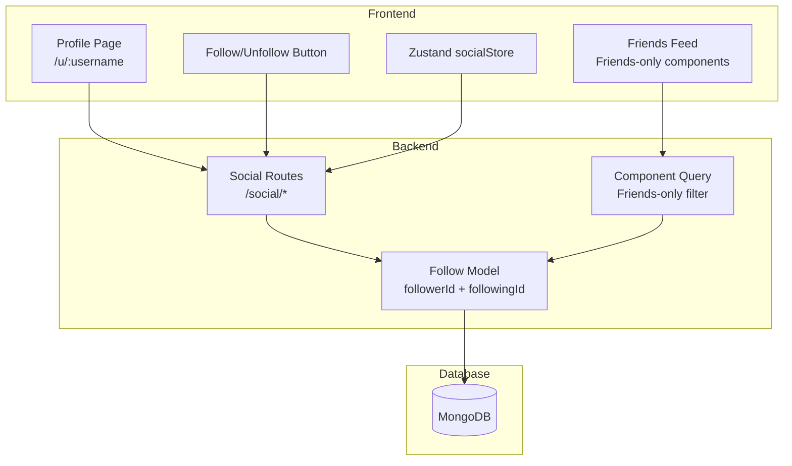

# Chunk 7 — Social Follow System Implementation Plan

> **Status**: 🔲 todo → 🔄 in-progress  
> **Branch**: `feat/social-follow` (from `develop`)  
> **Depends on**: Chunk 6 (Privacy Levels)

---

## Overview

This chunk implements a social follow system that enables:
- Users to follow/unfollow other users
- Friends-only component visibility (mutual followers)
- Public profile pages
- Friends-only components in feed

---

## Architecture Diagram



---

## Data Model

### Follow Model (`backend/src/models/Follow.ts`)

```typescript
interface IFollow {
  followerId: ObjectId;   // Who is following
  followingId: ObjectId;  // Who is being followed
  createdAt: Date;
}
```

**Indexes**:
- Compound unique index: `{ followerId: 1, followingId: 1 }`
- Index on `followingId` for efficient "followers" queries
- Index on `followerId` for efficient "following" queries

**Business Rules**:
- User cannot follow themselves
- Duplicate follows prevented by unique index

---

## API Endpoints

### Social Routes (`backend/src/routes/social.ts`)

| Method | Endpoint | Auth | Description |
|--------|----------|------|-------------|
| POST | `/social/follow/:userId` | ✅ | Follow a user |
| DELETE | `/social/unfollow/:userId` | ✅ | Unfollow a user |
| GET | `/social/following` | ✅ | List users I follow |
| GET | `/social/followers` | ✅ | List my followers |
| GET | `/social/friends` | ✅ | List mutual followers (friends) |
| GET | `/social/status/:userId` | ✅ | Check follow status with a user |

### Enhanced Component Routes

| Method | Endpoint | Auth | Description |
|--------|----------|------|-------------|
| GET | `/components/friends` | ✅ | Get friends-only components from friends |
| GET | `/components/user/:username` | ❌ | Get public components by username |

### User Routes (New)

| Method | Endpoint | Auth | Description |
|--------|----------|------|-------------|
| GET | `/users/:username` | ❌ | Get public user profile |

---

## Frontend Components

### New Files to Create

```
web/src/
├── models/
│   └── follow.ts           # Follow types
├── store/
│   └── socialStore.ts      # Zustand store for social state
├── pages/
│   └── ProfilePage.tsx     # User profile page /u/:username
├── components/
│   └── social/
│       ├── FollowButton.tsx        # Follow/Unfollow button
│       ├── UserCard.tsx            # User info card
│       └── FriendsFeedSection.tsx  # Friends-only components section
```

### Modified Files

```
web/src/
├── App.tsx                 # Add /u/:username route
├── pages/ExplorePage.tsx   # Add friends feed section
├── lib/api.ts              # Add social API calls (if needed)
```

---

## Implementation Steps

### Phase 1: Backend Model & Routes

#### Step 1.1: Create Follow Model
- [ ] Create `backend/src/models/Follow.ts`
- [ ] Define IFollow interface
- [ ] Create schema with indexes

#### Step 1.2: Create Social Routes
- [ ] Create `backend/src/routes/social.ts`
- [ ] Implement `POST /social/follow/:userId`
- [ ] Implement `DELETE /social/unfollow/:userId`
- [ ] Implement `GET /social/following`
- [ ] Implement `GET /social/followers`
- [ ] Implement `GET /social/friends` (mutual followers)
- [ ] Implement `GET /social/status/:userId`

#### Step 1.3: Register Routes
- [ ] Import and register social routes in `backend/src/index.ts`

#### Step 1.4: Add Friends-Only Component Query
- [ ] Add `GET /components/friends` endpoint
- [ ] Query components where:
  - `privacy: 'friends'` AND
  - `ownerId` is in the user's friends list (mutual followers)

#### Step 1.5: Add User Profile Endpoint
- [ ] Add `GET /users/:username` for public profile
- [ ] Add `GET /components/user/:username` for user's public components

---

### Phase 2: Frontend Types & Store

#### Step 2.1: Create Follow Types
- [ ] Create `web/src/types/follow.ts`
- [ ] Define `Follow`, `UserProfile`, `FollowStatus` types

#### Step 2.2: Create Social Store
- [ ] Create `web/src/store/socialStore.ts`
- [ ] State: `following`, `followers`, `friends`, `loading`, `error`
- [ ] Actions: `followUser`, `unfollowUser`, `fetchFollowing`, `fetchFriends`, etc.

---

### Phase 3: Frontend UI Components

#### Step 3.1: Create Follow Button Component
- [ ] Create `web/src/components/social/FollowButton.tsx`
- [ ] Props: `targetUserId`, `initialStatus`
- [ ] Handle follow/unfollow toggle
- [ ] Show loading state

#### Step 3.2: Create User Card Component
- [ ] Create `web/src/components/social/UserCard.tsx`
- [ ] Display username, stats (components count, followers, following)
- [ ] Include FollowButton

#### Step 3.3: Create Profile Page
- [ ] Create `web/src/pages/ProfilePage.tsx`
- [ ] Route: `/u/:username`
- [ ] Show user info + public components
- [ ] Show FollowButton if viewing other user's profile

#### Step 3.4: Create Friends Feed Section
- [ ] Create `web/src/components/social/FriendsFeedSection.tsx`
- [ ] Display friends-only components from mutual followers
- [ ] Add to ExplorePage or DashboardPage

---

### Phase 4: Integration

#### Step 4.1: Update App Routes
- [ ] Add `/u/:username` route to `web/src/App.tsx`

#### Step 4.2: Update Explore Page
- [ ] Add friends feed section to ExplorePage
- [ ] Tab or section for "Friends' Components"

#### Step 4.3: Link Usernames
- [ ] Make usernames clickable throughout the app
- [ ] Components in explore → link to owner's profile
- [ ] Navigate to `/u/:username` on click

---

## Verification Checklist

- [ ] Can follow another user
- [ ] Can unfollow a user
- [ ] Mutual followers see each other's friends-only components
- [ ] Profile page shows public components
- [ ] Follow button updates correctly
- [ ] Friends feed shows friends-only components
- [ ] Cannot follow self
- [ ] Cannot follow same user twice

---

## API Response Examples

### POST /social/follow/:userId
```json
// Success (201)
{
  "message": "Successfully following user",
  "follow": {
    "followerId": "...",
    "followingId": "...",
    "createdAt": "2026-03-13T..."
  }
}

// Error (400) - Self follow
{
  "message": "Cannot follow yourself"
}

// Error (404) - User not found
{
  "message": "User not found"
}
```

### GET /social/friends
```json
{
  "friends": [
    {
      "_id": "...",
      "username": "johndoe",
      "createdAt": "2026-01-15T..."
    }
  ]
}
```

### GET /components/friends
```json
{
  "components": [
    {
      "_id": "...",
      "title": "My Button",
      "privacy": "friends",
      "ownerId": {
        "_id": "...",
        "username": "johndoe"
      }
    }
  ]
}
```

---

## Best Practices to Follow

From GUIDELINES.md:

1. **File Organization**: One concern per file
2. **Route Files**: Export single Router, register in index.ts
3. **Models**: Put business logic on schema methods
4. **Error Responses**: Always return `{ message: string }`
5. **HTTP Status Codes**: Use appropriate codes (200, 201, 400, 401, 403, 404, 500)
6. **Conventional Commits**: `feat: social follow system with friends-only visibility`

---

## Dependencies

No new npm packages required. Using existing:
- `mongoose` for Follow model
- `express` for routes
- Zustand for state management (already installed)

---

## Estimated File Changes

| File | Action |
|------|--------|
| `backend/src/models/Follow.ts` | Create |
| `backend/src/routes/social.ts` | Create |
| `backend/src/routes/components.ts` | Modify (add friends endpoint) |
| `backend/src/index.ts` | Modify (register social routes) |
| `web/src/types/follow.ts` | Create |
| `web/src/store/socialStore.ts` | Create |
| `web/src/components/social/FollowButton.tsx` | Create |
| `web/src/components/social/UserCard.tsx` | Create |
| `web/src/components/social/FriendsFeedSection.tsx` | Create |
| `web/src/pages/ProfilePage.tsx` | Create |
| `web/src/App.tsx` | Modify (add route) |
| `web/src/pages/ExplorePage.tsx` | Modify (add friends section) |
| `docs/PLAN.md` | Update status |
