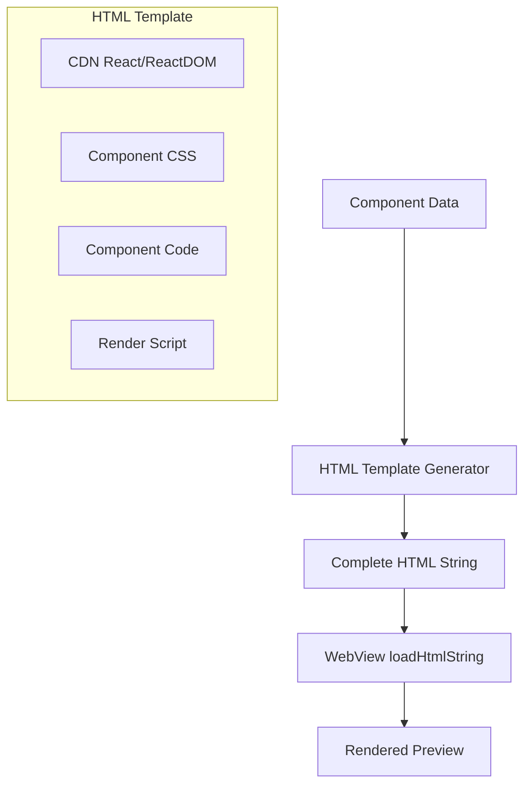

# Local HTML Preview Plan for Mobile App

## Overview

Replace the current WebView-based preview (which loads from web app URL) with a local HTML generation approach that embeds component code directly. This enables offline preview and eliminates dependency on the web app.

## Current Implementation

- [`ComponentPreview`](mobile/lib/widgets/component_preview.dart) uses WebView to load `ApiConfig.publicPreviewUrl(componentId)`
- This requires the web app to be running and accessible
- Causes "Connection Refused" errors when web app is not available

## Proposed Solution

Generate HTML locally with component code embedded, using CDN-hosted React/ReactDOM for rendering.

## Architecture



## Implementation Steps

### Step 1: Create HTML Template Generator

Create a new utility class that generates HTML from component data:

**File:** `mobile/lib/utils/preview_html_generator.dart`

```dart
class PreviewHtmlGenerator {
  static String generate({
    required String code,
    String? cssCode,
    String language = 'javascript',
    String template = 'react',
  }) {
    return '''
<!DOCTYPE html>
<html>
<head>
  <meta charset="UTF-8">
  <meta name="viewport" content="width=device-width, initial-scale=1.0">
  <style>
    * { box-sizing: border-box; margin: 0; padding: 0; }
    body { font-family: -apple-system, BlinkMacSystemFont, 'Segoe UI', Roboto, sans-serif; }
    #root { padding: 16px; }
    ${cssCode ?? ''}
  </style>
</head>
<body>
  <div id="root"></div>
  <script src="https://unpkg.com/react@18/umd/react.production.min.js"></script>
  <script src="https://unpkg.com/react-dom@18/umd/react-dom.production.min.js"></script>
  <script src="https://unpkg.com/@babel/standalone/babel.min.js"></script>
  <script type="text/babel">
    $code
    
    // Auto-render default export or App component
    const App = typeof default !== 'undefined' ? default : (typeof App !== 'undefined' ? App : null);
    if (App) {
      ReactDOM.createRoot(document.getElementById('root')).render(<App/>);
    }
  </script>
</body>
</html>
''';
  }
}
```

### Step 2: Update ComponentPreview Widget

Modify [`component_preview.dart`](mobile/lib/widgets/component_preview.dart) to:

1. Accept component data directly instead of just ID
2. Generate HTML locally
3. Use `loadHtmlString()` instead of `loadRequest()`

**Key Changes:**

```dart
class ComponentPreview extends StatefulWidget {
  final String componentId;
  final String code;           // Add
  final String? cssCode;       // Add
  final String language;       // Add
  final String template;       // Add

  // ...
}

void _initWebView() {
  final html = PreviewHtmlGenerator.generate(
    code: widget.code,
    cssCode: widget.cssCode,
    language: widget.language,
    template: widget.template,
  );
  
  _controller = WebViewController()
    ..setJavaScriptMode(JavaScriptMode.unrestricted)
    ..loadHtmlString(html);
}
```

### Step 3: Update ComponentDetailScreen

Modify [`component_detail_screen.dart`](mobile/lib/screens/component_detail_screen.dart) to pass component data to preview:

```dart
ComponentPreview(
  componentId: component.id,
  code: component.code,
  cssCode: component.cssCode,
  language: component.language,
  template: component.template ?? 'react',
)
```

## CDN Dependencies

For React components, the HTML will load:
- React 18 (production build)
- ReactDOM 18 (production build)
- Babel standalone (for JSX transformation)

**Note:** First load requires internet connection to fetch CDN assets. After that, browser caching may help.

## Advantages

1. **Offline Support** - Works without web app running
2. **Faster Loading** - No network round-trip to web app
3. **Simpler Architecture** - No dependency on web app for preview
4. **Better Error Handling** - Full control over preview rendering

## Limitations

1. **CDN Dependency** - First load needs internet for React/Babel
2. **Template Support** - Initially supports React; other templates need additional work
3. **Complex Components** - Components with npm dependencies won't work without bundling

## Alternative: Enhanced Offline Support

For true offline support, consider bundling React/ReactDOM with the app:

1. Add React/ReactDOM as assets in `pubspec.yaml`
2. Load from local assets instead of CDN
3. Requires larger app size (~150KB for React+ReactDOM)

## Files to Modify

| File | Action |
|------|--------|
| `mobile/lib/utils/preview_html_generator.dart` | Create new |
| `mobile/lib/widgets/component_preview.dart` | Modify |
| `mobile/lib/screens/component_detail_screen.dart` | Modify |

## Testing Checklist

- [ ] React components render correctly
- [ ] CSS styles are applied
- [ ] Error handling for malformed code
- [ ] Loading states display properly
- [ ] Works without web app running
